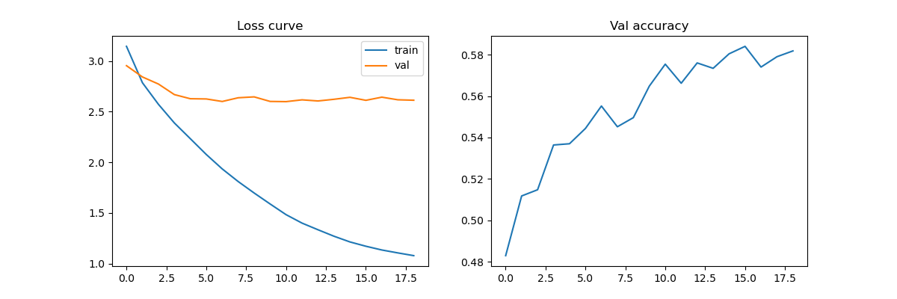

# CIFAR-10 三层神经网络分类器

## 目录
- [环境配置](#环境配置)
- [数据集准备](#数据集准备)
- [快速开始](#快速开始)
  - [训练模型](#训练模型)
  - [测试模型](#测试模型)
- [超参数搜索](#超参数搜索)
- [可视化](#可视化)
- [文件结构](#文件结构)
- [常见问题](#常见问题)

---

## 环境配置

### 使用 conda  
    conda create -n your_env_name python=3.10  
    conda activate your_env_name  

### 使用 pip 
    pip install numpy==1.22.4 matplotlib==3.7.1

---

## 数据集准备
1. 从[CIFAR-10官网](https://www.cs.toronto.edu/\~kriz/cifar-10-python.tar.gz)下载数据集

2. 解压后确保目录结构如下：  
    project_root/  
    └── data/  
        └── cifar-10-batches-py/  
            ├── data_batch_1  
            ├── data_batch_2  
            ├── data_batch_3  
            ├── data_batch_4  
            ├── data_batch_5  
            └── test_batch

---

## 快速开始

### 训练模型
    python train.py
    --data_dir data/cifar-10-batches-py
    --hidden_sizes 512 256
    --lr 0.005
    --reg 0.001
    --batch_size 128

**输出文件**:
- `best_model.npz` - 最佳模型权重
- `training_curve.png` - loss曲线可视化

---

### 测试模型
    python test.py
    --model_path checkpoints/best_model.npz
    --data_dir data/cifar-10-batches-py

**预期输出**:
[INFO] 测试准确率: 58.72%
结果已保存至 test_accuracy.txt

---

## 超参数搜索
    python hyperparam.py

**输出文件**:
- `hyperparam_results.txt` - 搜索结果表格

---

## 可视化

### 训练曲线

### 权重可视化
    python visualize_weights.py

---

## 文件结构
    .
    ├── data_loader.py # 数据加载
    ├── model.py # 网络定义
    ├── train.py # 训练脚本
    ├── utils.py # 辅助函数
    ├── test.py # 测试脚本
    ├── hyperparam.py # 超参数搜索脚本
    ├── visualize_weights.py # 权重可视化脚本
    ├── train_curve.png
    ├── weight_visualization.png
    └── README.md

---

## 常见问题

### 1. 数据集路径错误
> 错误信息：  
`FileNotFoundError: No such file or directory: 'data/cifar-10-batches-py'`

解决方案：
- 修改所有脚本中的 --data_dir 参数为绝对路径

解决方案：
- 减小批次大小  
- 简化网络结构

### 3. 依赖版本冲突
- 安装指定版本  
    pip install numpy==1.22.4 matplotlib==3.7.1

---

**模型权重下载**  
[百度网盘链接](https://pan.baidu.com/s/1djeQeHIPU2ilmwnR0X8xPQ?pwd=hewi )
